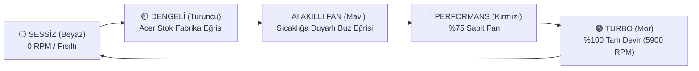
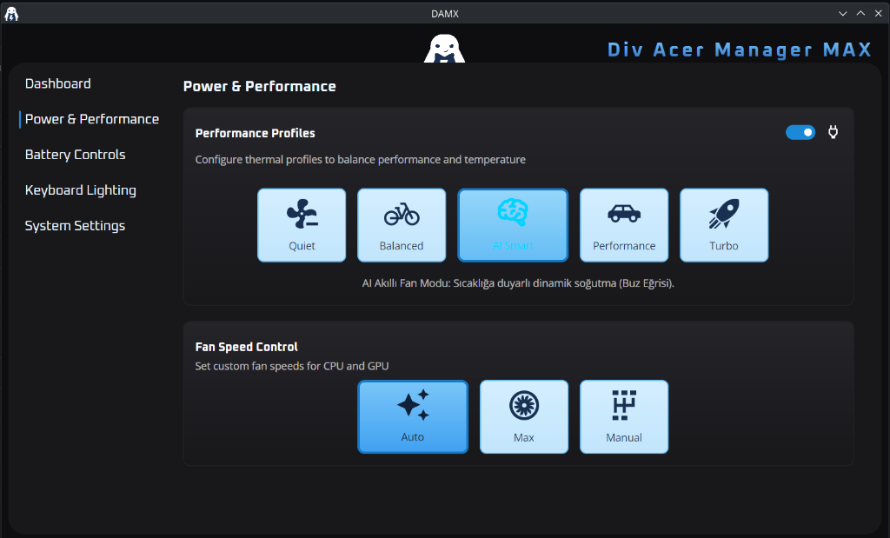
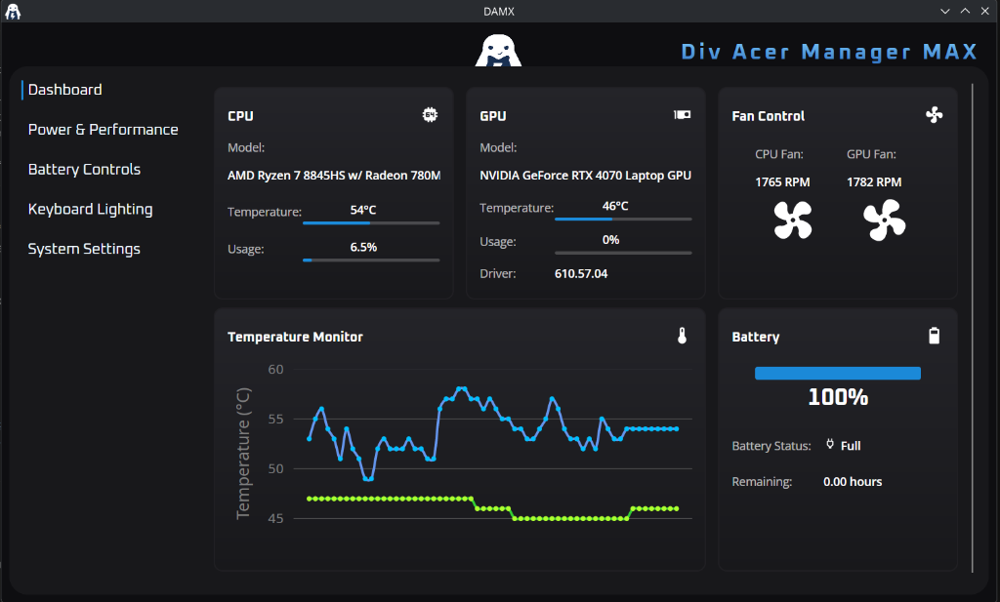

<p align="center">
  
</p>

<h1 align="center">myf-damx (Div Acer Manager Max) 🎮❄️</h1>

<p align="center">
  <b>Acer Nitro & Predator Serisi için 5 Modlu Termal Kontrol, AI Akıllı Fan Motoru ve Avalonia GUI Merkezi</b><br>
  <i>Özellikle Acer Nitro 16 (AN16-42 / Ryzen Zen 4) Donanımı için Gelişmiş Dinamik Soğutma ve Animasyonlarla Zenginleştirilmiştir</i>
</p>

<p align="center">
  <a href="https://github.com/bymayfe/myf-damx/releases"></a>
  <a href="LICENSE"></a>
  <a href="https://github.com/PXDiv/Div-Acer-Manager-Max"></a>
  <a href="https://github.com/bymayfe/myf-linuwu"></a>
</p>

---

## 📌 Proje Hakkında & Orijinal Kaynak

Bu proje, Acer Nitro ve Predator laptoplar için geliştirilen modern Avalonia C# kontrol paneli **[PXDiv / Div-Acer-Manager-Max (DAMX)](https://github.com/PXDiv/Div-Acer-Manager-Max)** projesinden çatallanmış (fork) ve **[@bymayfe](https://github.com/bymayfe)** tarafından yeni termal modlar, yapay zeka destekli akıllı fan kontrolü ve dinamik RGB bildirimleri ile güçlendirilmiştir.

### 🌟 Orijinal Geliştiricilere Atıf & Teşekkür:
- **DAMX GUI & Daemon Yaratıcısı:** [@PXDiv](https://github.com/PXDiv) ([Div-Acer-Manager-Max Deposu](https://github.com/PXDiv/Div-Acer-Manager-Max))
- **Kernel Sürücü Temeli:** [@0x7375646F](https://github.com/0x7375646F) ([Linuwu-Sense Deposu](https://github.com/0x7375646F/Linuwu-Sense))

---

## 🚀 Orijinal DAMX'e Göre Yapılan Farklılıklar & Yeni Özellikler

> 📖 **Detaylı teknik değişiklik günlüğü için [CHANGELOG.md](CHANGELOG.md) dosyasına göz atabilirsiniz.**

| Özellik | Orijinal `DAMX` | `myf-damx` (Bu Gelişmiş Sürüm) |
| :--- | :--- | :--- |
| **Termal Profil Modları (AC Şarj)** | 4 Mod (Quiet, Balanced, Performance, Turbo) | 🚀 **5 Modlu Tam Döngü:** (⚪ Sessiz ➔ 🟡 Dengeli ➔ 🔵 **AI Akıllı Fan** ➔ 🔴 Performans ➔ 🟣 Turbo) |
| **⚡ Canlı UI Senkronizasyonu (Live Sync)** | ❌ Buton basılınca GUI güncellenmez | ✅ **Tam Canlı:** Fiziksel tuşa basıldığı an GUI'deki butonlar ve açıklamalar **anlık olarak canlı değişir** |
| **🔄 Uygulama Açılışındaki Mod Yenilemesi** | ⚠️ Yanlış/varsayılan profile atlayabilir | ✅ **Düzeltildi:** Uygulama açıldığı an donanımın ve daemon'un gerçek durumu hatasız okunur |
| **🔁 Event Loop & Kilitlenme Düzeltmesi** | ⚠️ `IsCheckedChanged` ile programmatic loop riski | ✅ **Düzeltildi:** `Click` bazlı tetikleme ile UI kilitlenmeleri tamamen engellendi |
| **🔵 AI Akıllı Fan Motoru (Buz Eğrisi)** | ❌ Yok (Sadece sabit veya stok eğri) | ✅ `SmartFanWorker` işlemci sıcaklığına göre (`<55°C` %0, `55-68°C` %45, `68-78°C` %65, `>85°C` %100) dinamik ve sessiz soğutur |
| **Fan Hunting / Titreme Önleme (Hysteresis)** | ❌ Yok | ✅ Eşik geçişlerinde histeresis kontrolü ile fan motorunun gereksiz devir dalgalanmasını önler |
| **⚡ Mavi Klavye Flaş Animasyonu (Pulse/Blink)** | ❌ Yok | ✅ AI Akıllı moda geçerken 4 bölge **2 kez parlak Neon Mavi yanıp söner**, ardından kullanıcının kendi renk döngüsüne döner |
| **Fiziksel Mod & Nitro Tuşu Entegrasyonu** | Sadece arayüz veya temel yakalama | ✅ Program kapalıyken bile fiziksel tuşa her basıldığında OSD bildirimleriyle 5 modu sırayla döner |
| **⌨️ Fn+F11 / Fn+F12 Parlaklık & Nitro Tuşu** | ❌ Yok | ✅ `90-acer-nitro-an16.hwdb` kuralı ile klavye ışık tuşları ve NitroSense tuşu tam çalışır |
| **🖱️ Wayland / KDE Touchpad Geçişi** | ❌ X11 sınırlı | ✅ Wayland & KDE Plasma 6 D-Bus senkronizasyonlu `toggle-touchpad.sh` |
| **GUI Güncellemesi (Avalonia C#)** | 4 Buton | ✅ **`AI Smart` (Neon Cyan / Brain İkonu)** butonu XAML & C# katmanına eklendi ve derlendi |
| **Kurulum Kolaylığı** | Karışık script menüsü | ✅ İnteraktif, açıklamalı ve modüler `sudo ./install.sh` |

---

## 🎮 5'li Termal Profil Döngüsü

Laptopun üzerindeki fiziksel mod tuşuna basıldığında (veya GUI üzerinden) sırasıyla:



### 🔋 Pildeyken:
- 🟢 **ECO Modu (`low-power`)** ⮀ 🟡 **Dengeli Mod (`balanced`)**

---

## 🛠️ Kurulum Rehberi

### Gereksinimler:
* [.NET 9.0 SDK](https://dotnet.microsoft.com/download) (`dotnet-sdk-9.0` veya `dotnet-runtime-9.0`)
* `python3`, `python-evdev`, `systemd`, `libnotify`
* [myf-linuwu](https://github.com/bymayfe/myf-linuwu) çekirdek sürücüsü

### Tek Komutla Kurulum:
```bash
git clone https://github.com/bymayfe/myf-damx.git
cd myf-damx
chmod +x install.sh uninstall.sh
sudo ./install.sh
```

### Programı Çalıştırma:
```bash
damx
```

### Kaldırma (Uninstall):
```bash
sudo ./uninstall.sh
```

---

## 📸 Ekran Görüntüleri

<p align="center">
  
</p>
<p align="center">
  
</p>

---

## 🤝 Katkıda Bulunma & Destek

Hata bildirimleri, öneriler ve katkılar için GitHub üzerinden Issue veya Pull Request açabilirsiniz.

---

## 📜 Lisans

Bu proje **GNU General Public License v3.0 (GPL-3.0)** altında lisanslanmıştır.  
Detaylar için [LICENSE](LICENSE) dosyasına bakabilirsiniz.
